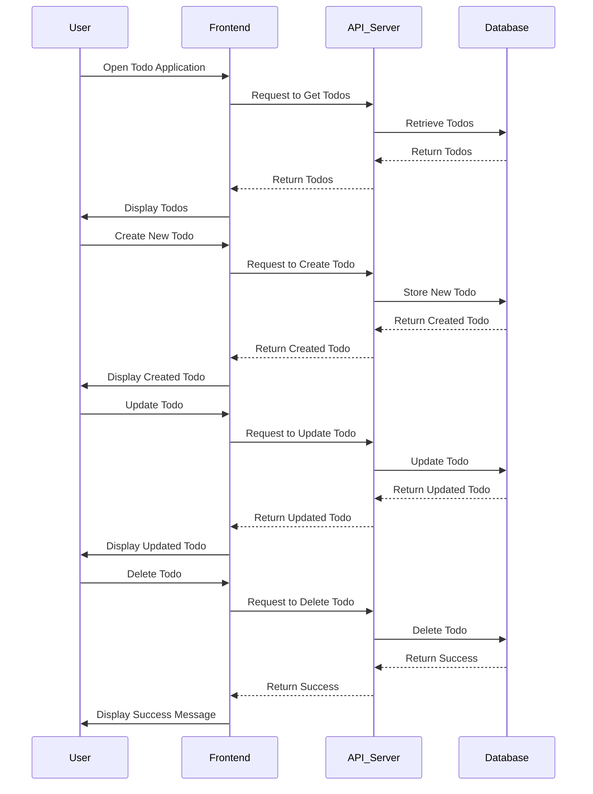

<h1 align="center"> First TypeScript Todo </h1>


<p align="center">
This project is a simple todo REST APIs application implemented using TypeScript. It allows users to create, update, and delete tasks in a todo list. The project is built with a focus on TypeScript development practices and follows industry-standard coding conventions.
</p>

## Table of Contents

- [Features](#features)
- [Installation](#installation)
- [Tech Stack](tech-stack)
- [Usage](#usage)
- [API Reference](#api-reference)
- [Project Diagram](#project-diagram)
- [Contributing](#contributing)
- [License](#license)

## Features

- Create new tasks with a title and description.
- Mark tasks as complete or incomplete.
- Edit and update task details.
- Delete tasks from the todo list.

## Tech Stack 
<p>
 <a href="https://www.typescriptlang.org/">
        
    </a>
 <a href="https://nodejs.org/">
        
    </a>
 </p>

## Installation

To run this project locally, follow these steps:

1. Clone the repository:

   ````shell
   git clone https://github.com/ahmedeid6842/Code-Base.git
   ```

2. Navigate to the project directory:

   ````shell
   cd "Code-Base/first typescript todo"
   ```

3. Install the dependencies:

   ````shell
   npm install
   ```

## Usage

To start the application, use the following command:

```shell
npm run dev
```

Open your web browser and navigate to `http://localhost:3000` to access the todo application.

## API Reference

The API of the First TypeScript Todo project follows RESTful principles. Here is the reference for the available endpoints:

| Endpoint       | Method | Request Body              | Response Body    | Description                   |
| -------------- | ------ | ------------------------- | ---------------- | ----------------------------- |
| `/todos`       | GET    | -                         | Array of todos   | Get all todos                 |
| `/todos`       | POST   | Todo object               | Created todo     | Create a new todo             |
| `/todos/:id`   | GET    | -                         | Todo object      | Get a specific todo by ID     |
| `/todos/:id`   | PUT    | Updated todo object       | Updated todo     | Update a specific todo by ID  |
| `/todos/:id`   | DELETE | -                         | Success message  | Delete a specific todo by ID  |

## Project Diagram

The following diagram illustrates the revised high-level architecture of the First TypeScript Todo project, based on the provided code architecture:
Certainly! Here's an additional sequence diagram that showcases the user interaction flow in the First TypeScript Todo project:



This sequence diagram illustrates the flow of user interactions with the Frontend, API Server, and Database components in the First TypeScript Todo project. It showcases the steps involved in retrieving todos, creating a new todo, updating a todo, and deleting a todo.

## Contributing

Contributions are welcome! If you would like to contribute to this project, please follow these steps:

1. Fork the repository.
2. Create a new branch for your feature or bug fix.
3. Make your changes and commit them.
4. Push your changes to your forked repository.
5. Submit a pull request to the original repository.

## License

This project is licensed under the [MIT License](LICENSE).
