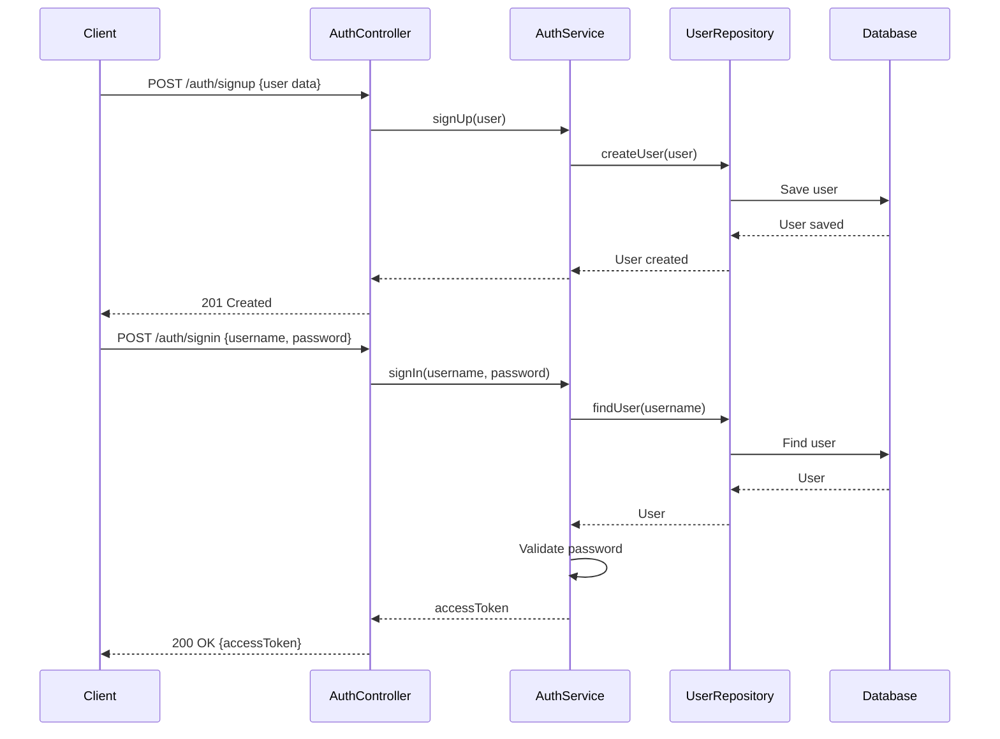

<h1 align="center"> NestJS Task Management </h1>

<p align="center">
  <a href="http://nestjs.com/" target="blank"></a>
</p>

[circleci-image]: https://img.shields.io/circleci/build/github/nestjs/nest/master?token=abc123def456
[circleci-url]: https://circleci.com/gh/nestjs/nest

  <p align="center">This is a task management backend application developed as part of the "NestJS Zero to Hero - Modern TypeScript Back-end Development" Udemy course by Ariel Weinberger.</p>
    <p align="center">
<a href="https://www.linkedin.com/in/ameid/"><a>
</p>


## Table of Contents

- [Introduction](#introduction)
- [Installation](#installation)
- [Usage](#usage)
- [Acknowledgement](#acknowledgement)
- [Contributing](#contributing)
- [License](#license)

## Introduction

The NestJS Task Management application is a powerful backend solution for managing tasks. It provides a secure and scalable architecture built with NestJS and TypeScript. The application includes features such as user authentication, task creation, updating, and deletion, as well as task filtering and sorting.

## Installation

To run the NestJS Task Management application locally, follow these steps:

1. Clone the repository:

   ```bash
   git clone https://github.com/ahmedeid6842/Code-Base.git
   ```

1. Navigate to the project directory:

   ```bash
   cd Code-Base/nestjs-course-task-management
   ```

1. Install the dependencies:

   ```bash
   npm install
   ```
   
1. Run the application:

   ```bash
   npm run start:dev
   ```

The application will be accessible at `http://localhost:3000`.

## Usage

Once the application is up and running, you can use the following endpoints to interact with the API:

- **POST /auth/signup**: Create a new user account.
- **POST /auth/signin**: Authenticate and obtain an access token.
- **GET /tasks**: Get a list of tasks.
- **GET /tasks/:id**: Get a specific task.
- **POST /tasks**: Create a new task.
- **PATCH /tasks/:id**: Update a task.
- **DELETE /tasks/:id**: Delete a task.

Make sure to include the access token in the request headers for authenticated endpoints:

```
Authorization: Bearer <access_token>
```



## Acknowledgement

Special thanks to [Ariel Weinberger](https://github.com/arielweinberger) for his NestJS course, which was an invaluable resource in building this project.

## Contributing

Contributions to the NestJS Task Management project are welcome. If you find a bug or have suggestions for improvements, please open an issue or submit a pull request. Ensure that you follow the project's code of conduct.

## License

This project is licensed under the [MIT License](https://opensource.org/licenses/MIT). See the `LICENSE` file for more information.


