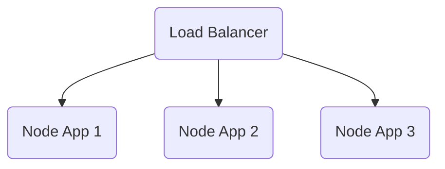
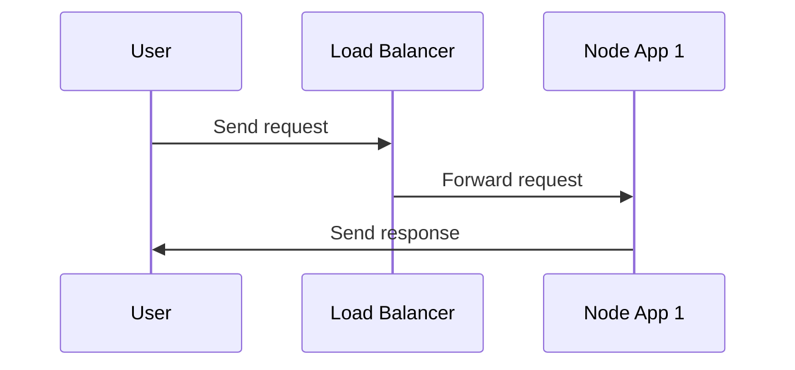

<h1 align="center"> Load balancer - Haproxy</h1>


<p align="center" > </p>

## Project Overview

This project is a simple load balancing setup using Haproxy. It has three node applications, each running on a different port. The load balancer distributes traffic among the three applications.

## Getting Started

To get started with the project, you will need to:

1. Install Docker and Docker Compose.
2. Clone the repository:

```
git clone https://github.com/ahmedeid6842/Code-Base.git
```

3. Go to the project directory:

```
cd nodeapp_loadbalance
```

4. Build the images:

```
docker-compose build
```

5. Start the containers:

```
docker-compose up
```

The load balancer will be running on port 8080. You can access the different applications by adding the application's port number to the URL. For example, to access the first application, you would go to `http://localhost:8080/1111`.

## Diagrams

Here is a diagram of the load balancing setup:



This diagram shows how the load balancer distributes traffic among the three node applications. The load balancer listens on port 8080 and then forwards requests to the appropriate node application.

Here is a diagram of the request flow:



This diagram shows how a user sends a request to the load balancer. The load balancer then forwards the request to the appropriate node application. The node application then sends a response back to the user.

## Further Reading

* Haproxy: https://www.haproxy.org/
* Docker: https://www.docker.com/
* Docker Compose: https://docs.docker.com/compose/
