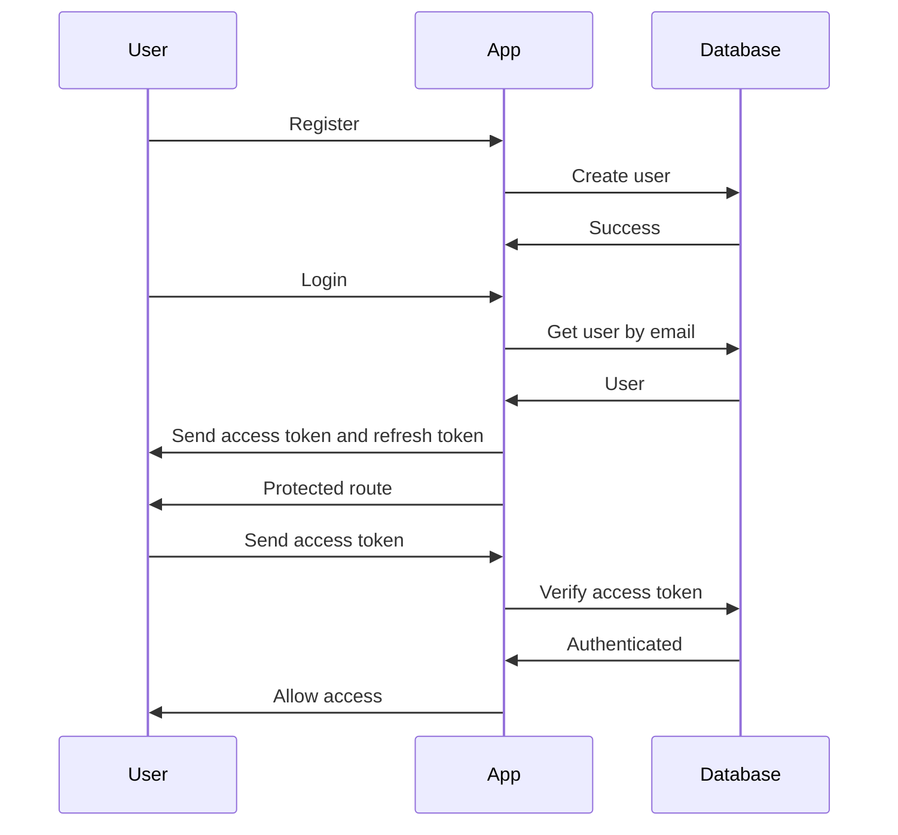

<h1 align="center"> Token </h1>

<p align="center"> </p>

## Project Overview

This project is a simple Node.js application that implements authentication and authorization using JSON Web Tokens (JWTs).

The application has the following features:

* Register a user
* Login a user
* Logout a user
* Protect a route with authentication
* Refresh an access token

## Getting Started

To get started with the project, you will need to:

1. Install the dependencies:

```
npm install
```

2. Create a `.env` file and add the following environment variables:

```
ACCESS_TOKEN_SECRET=your_access_token_secret
REFRESH_TOKEN_SECRET=your_refresh_token_secret
PORT=3000
```

3. Run the application:

```
node index.js
```

The application will be running on port 3000.

## Usage

To register a user, you can use the following POST request:

```
POST /register
{
  "email": "your_email",
  "password": "your_password"
}
```

To login a user, you can use the following POST request:

```
POST /login
{
  "email": "your_email",
  "password": "your_password"
}
```

The response will contain the access token and refresh token.

To protect a route with authentication, you can use the `isAuth` middleware. For example, the following route will only be accessible to authenticated users:

```
app.post("/protected", isAuth, async (req, res) => {
  // Only authenticated users can access this route
});
```

To refresh an access token, you can use the following POST request:

```
POST /refresh_token
```

The response will contain the new access token.

## Diagrams

Here is a diagram of the authentication and authorization flow in the application:



This diagram shows how the user registers and logs in to the application. The application then generates an access token and refresh token for the user. The user can use the access token to access protected routes in the application. The refresh token can be used to get a new access token if the old access token expires.

## Further Reading

* JSON Web Tokens (JWT): https://jwt.io/
* Express: https://expressjs.com/
* Mongoose: https://mongoosejs.com/
